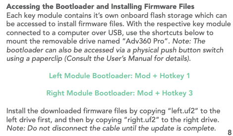
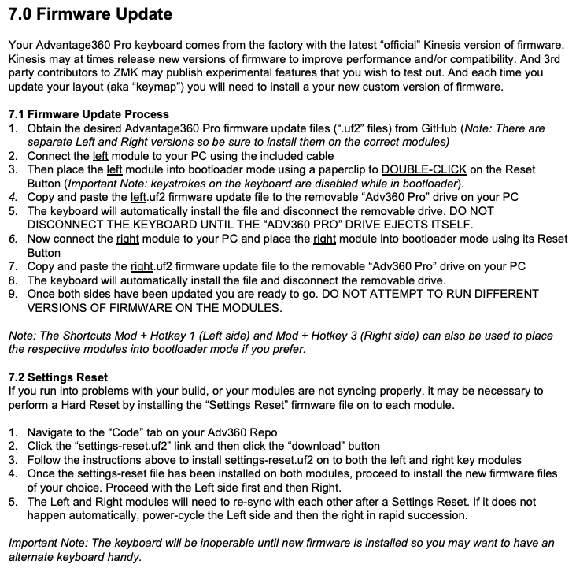

# Advantage 360 Firmware Generator

This code provides a way to generate a firmware file for the Advantage 360 keyboard.
It will pull this code from the [Adv360-Pro-ZMK](https://github.com/KinesisCorporation/Adv360-Pro-ZMK) project, 
and generate keymap files from the `keys.json` file.

The `keys.json` file was created to be an easier way to generate the 2 different keymap files. 

These steps allow you to more easily generate Firmware files for your Advantage 360 keyboard, 
without mingling your config with the rest of the ZMK code.

This also helps if you want to use sensitive data in your keymap/macros, like your email address, without having to worry about it being public.

## Get Started

```bash
git clone 
cd advantageFirmwareGenerator
cp keys-template.json keys.json
cp macros-template.dtsi macros.dtsi
```

## Edit keys.json

The `keys.json` file is used to generate the keymap files.

The first section `keyIds` can be used to define your own key ids.
In this case, the key id `escape` is the key on the left side of the keyboard, in the first row and first column.

```json
{
  "id": "escape",
  "group": "left",
  "row": 1,
  "column": 1
}
```

After defining the key ids, you can define the keymap for each layer.
The `layers` section has `base`, `keypad`, `fn`, and `mod` layers where you can define
what a keypress in each of those layers does.

These can trigger a keypress (kp)
```json
{
  "id": "number2",
  "action": "kp",
  "value": "N2"
},
```

fire a macro
```json
{
  "id": "macro1",
  "action": "macro_quotes",
  "value": ""
},
```

Note: you can use a comment to separate the layers, like this:

```json
{
  "comment": "=-=-=-=- Left Thumb Group -=-=-=-=-"
},
```

## Edit macros.dtsi

The `macros.dtsi` file is used to define macros that can be used in the `keys.json` file.
Some examples are provided in the file.

```javascript
macro_quotes: macro_quotes {
  compatible = "zmk,behavior-macro";
  label = "macro_quotes";
  #binding-cells = <0>;
  wait-ms = <1>;
  tap-ms = <1>;
  bindings = <&kp SQT>, <&kp SQT>, <&kp LEFT>;
};
```

Add any macros that you want to use in the `keys.json` file.

e.g.
```javascript
macro_copy: macro_copy {
  compatible = "zmk,behavior-macro";
  label = "macro_copy";
  #binding-cells = <0>;
  wait-ms = <1>;
  tap-ms = <1>;
  bindings = <&kp LG(C)>;
};

macro_paste: macro_paste {
  compatible = "zmk,behavior-macro";
  label = "macro_paste";
  #binding-cells = <0>;
  wait-ms = <1>;
  tap-ms = <1>;
  bindings = <&kp LG(V)>;
};
```


## Build Firmware

To build the firmware, execute the command
```shell
./buildFirmware.sh
```

The command uses `V3.0` branch by default. You can run on a different branch by using a parameter like: `./buildFirmware.sh V3.1`

*Note:* Major versions may not be backwards compatible. Some changes may be required to use a different version.

### Flash firmware

1. Generated firmware can be found in the `firmware` directory.
2. Press {MOD + HotKey 1 or 3}
3. Then drag the appropriate file to the "Adv360 Pro" drive. (Note: See "Issues" below)





## Customize adv360.keymap template

Normally you don't need to change anything in the template. But if you want to change the default keymap, you can do so by editing the `template.keymap` file.

The keymap file occasionally changes, so if you have customized yours, you may need to update the template. 

To generate a new template, run the following command:

```bash
./createTemplateKeymap.pl .Adv360/config/adv360.keymap > template.keymap
```

Note the lines containing a string like: `BINDINGS_base` are replaced with the key bindings.

## Contributing

If you have any suggestions, please open an issue or pull request.

Do not open a PR with keymaps, macros, firmware, or any Advantage 360 nor ZMK code.
These will be automatically closed.

## Resources can be found on Kinesis.com
* https://kinesis-ergo.com/support/kb360pro/#firmware-updates - Find the latest Settings Reset and Factory Default Firmware
* https://kinesis-ergo.com/support/kb360pro/#manuals


* https://github.com/zmkfirmware/zmk
* https://zmk.dev/docs/codes

## Issues
* [MacOS Ventura: Flashing fails with "unexpected error"](https://github.com/KinesisCorporation/Adv360-Pro-ZMK/issues/43)
  * Open on-screen keyboard, then `cp -X firmware/20221211085110-left.uf2 /Volumes/"Adv360 Pro"` 
  * https://osxdaily.com/2022/11/03/workaround-for-operation-cant-be-completed-unexpected-error-100093-macos-ventura-finder-error/